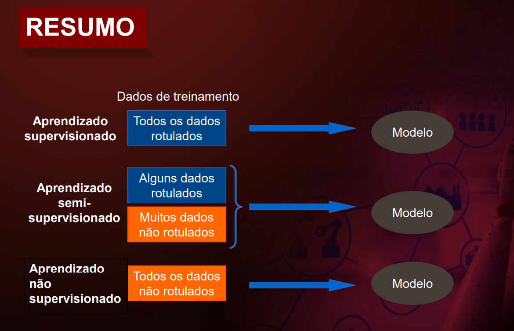
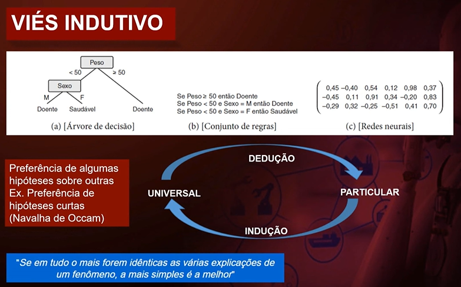
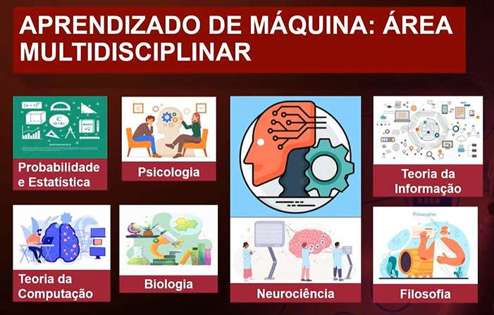
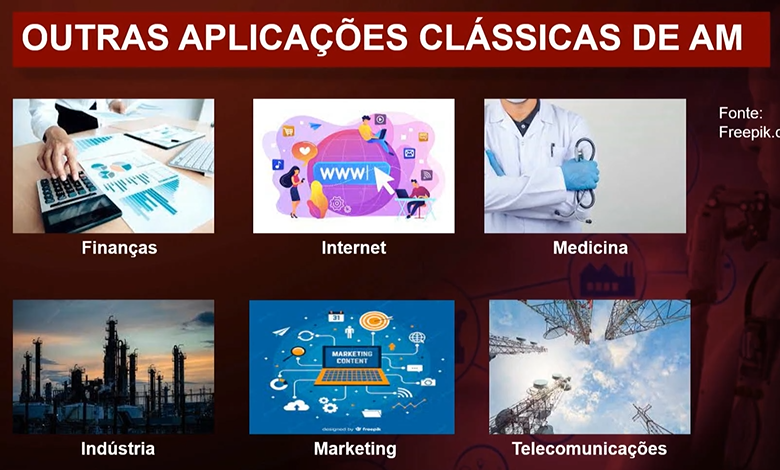
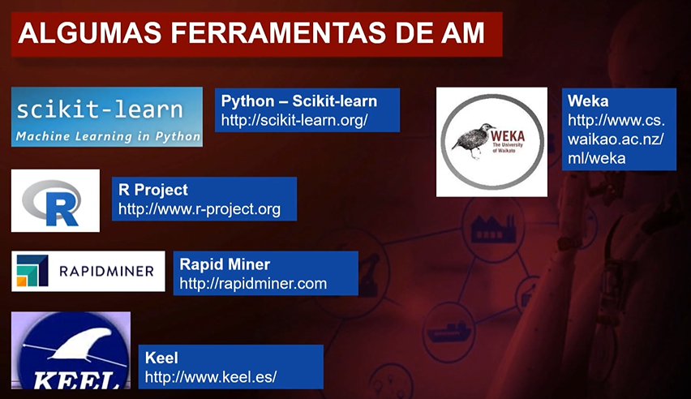

<!-- HEADER -->

<!-- TITLE -->

# A P R E N D I Z A D O - D E - M A Q U I N A

O aprendizado de máquina (em inglês, ML - Machine Learning) é um método de análise de dados que automatiza a construção de modelos analíticos.

| TIPO DE APRENDIZADO DE MÁQUINA     | APLICAÇÃO                                                 | DESCRIÇÃO                                                                                                                                                                                                                                                                   |
| ---------------------------------- | --------------------------------------------------------- | --------------------------------------------------------------------------------------------------------------------------------------------------------------------------------------------------------------------------------------------------------------------------- |
| Aprendizado __Supervisionado__     | Regressão e Classificação                                 | É necessário a intervenção humana para rotular os dados. **Aprendizado supervisionado**: algoritmos que fornecem às máquinas dados e seus rótulos esperados. Após o treinamento, o modelo deve ser capaz de classificar dados fora do conjunto de treinamento corretamente. |
| Aprendizado __Não Supervisionado__ | Agrupamento e Redução de Dimensionalidade                 | Não é necessário a intervenção humana para rotular os dados. **Aprendizado não supervisionado**: algoritmos em que se espera que a máquina detecte tendências nos dados sem nenhuma identificação prévia. Eles são úteis para identificar clusters (aglomerados) em dados.  |
| Aprendizado __Por Esforço__        | Métodos Heurísticos, Decisões em tempo Real e IA em Jogos | É semi-supervisonado, não há intervenção humana. **Aprendizado por reforço**: algoritmos que ensinam o modelo, dando reforços positivos para os resultados esperados e/ou reforços negativos para comportamentos indesejados.                                               |

 

| __FERRAMENTAS__                                     |
| --------------------------------------------------- |
| [scikit-learn](https://scikit-learn.org/stable/)    |
| [R Project](https://www.r-project.org/)             |
| [Rapid Miner](https://altair.com/altair-rapidminer) |
| [Keel](http://www.keel.es/)                         |
| [Weka](https://ml.cms.waikato.ac.nz/weka/)          |

 

| __CONJUNTO DE DADOS__                                                                       |
| ------------------------------------------------------------------------------------------- |
| [Machine Learning Data Repository UCIrvine](https://archive.ics.uci.edu/)                   |
| [Kaggle: competições práticas promovidas por empresas](https://www.kaggle.com/competitions) |
| [OpenML](https://www.openml.org/)                                                           |

 

EXPANDIR RESUMO
 

 

 

 

 

 

 

[:books: __IR PARA RESUMO MATERIAL__](./DOC/index.md) 

---

 

<!-- SEMANA 01 -->
>&#128311; **Semana 01**: Conceitos básicos de Aprendizado de Máquina/Classificação usando Árvores de Decisão
>> Aula 01 - [Conceitos básicos de Aprendizado de Máquina](https://www.youtube.com/watch?v=sLZeBzFPi10) 
>
>> Aula 02 - [Aprendizado para Classificação - Árvores de Decisão](https://www.youtube.com/watch?v=OBimUUS0Yhk) 
>
>> Aprofundando o tema - [Mais sobre Aprendizado de Máquina](https://www.youtube.com/watch?v=sfkQPD_0iGo) 

<!-- SEMANA 02 -->
>&#128310; **Semana 02**: Aprendizado de Regras de Classificação
>> Revisitando Conhecimentos - [Segurança da Informação - Aula 10 (Firewall)](https://www.youtube.com/watch?v=rIDIF0A0u2c) 
>
>> Aula 03 - [Aprendizado de regras](https://www.youtube.com/watch?v=GcKC_O9zovc) 
>
>> Aula 04 - [Algoritmos de Regras de Classificação](https://www.youtube.com/watch?v=7KdymzsHeJ4) 
>
>> Aula 05 - [Aplicação do algoritmo One-Rule](https://www.youtube.com/watch?v=fe0OxKojKy4) 
>
>> Aprofundando o tema - [Inteligência Artificial: Sistemas Especialistas](https://www.youtube.com/watch?v=C1jXUvRacWE) 

<!-- SEMANA 03 -->
>&#128311; **Semana 03**: Algoritmos Probabilísticos
>> Revisitando conhecimento - [Teoremas de probabilidade](https://www.youtube.com/watch?v=Q6PQkFYiCRs)
>
>> Aula 06 - [Aprendizado probabilístico](https://www.youtube.com/watch?v=oY3VbYEGNPg) 
>
>> Aula 07 - [Redes Bayesianas para classificação](https://www.youtube.com/watch?v=nvzUE6PnPYc) 
>
>> Aula 08 - [Aplicações do algoritmo Naive-Bayes](https://www.youtube.com/watch?v=GayrEYpxJQo) 
>
>> Aprofundando o tema - [IA - Programando Redes Bayesianas com Python](https://www.youtube.com/watch?v=i2XRQhede9U) 

<!-- SEMANA 04 -->
>&#128310; **Semana 04**: Virtualização
>> Aula 12 - [Virtualização – Contexto e Conceitos](https://www.youtube.com/watch?v=1yPE2vT6ifs) 
>
>> Aula 13 - [Tipos de Virtualização](https://www.youtube.com/watch?v=MVmPpNDKYXw) 
>
>> Aula 14 - [Exemplos de Virtualizadores e Ferramentas de Gerenciamento](https://www.youtube.com/watch?v=n1UpSddJTgg) 
>
>> Material de apoio - [Vídeo de apoio - Customização Virtualbox](https://www.youtube.com/watch?v=LAPSITwFSnA) 
>> Material de apoio - [O que é Virtualização - Introdução e conceitos básicos](https://www.youtube.com/watch?v=XD1zl2m9wSU) 
>> Material de apoio - [VirtualBOX - Conceitos de Virtualização Básico e Instalação](https://www.youtube.com/watch?v=_7vCg7gKTTU) 
>> Material de apoio - [Afinal como funciona a virtualização?](https://www.youtube.com/watch?v=FLhv_JcnYlU) 
>> Material de apoio - [Fundamentos da virtualização - VMware](https://www.youtube.com/watch?v=-9fcJ8KVeuw) 

<!-- SEMANA 05 -->
>&#128311; **Semana 05**: Arquiteturas SOA e Web Services
>> Revisitando Conhecimentos - [Arquitetura Orientada a Serviços - Aula 04 / parte 2 - Componentes de Software e Reúso 2020](https://www.youtube.com/watch?v=Ha4FbQZB1TU) 
>
>> Aula 15 - [SOA e Web Services](https://www.youtube.com/watch?v=eJ7giVunBkg) 
>
>> Aula 16 - [RESTFul Services](https://www.youtube.com/watch?v=Obxrck08Tlc) 
>
>> Material de apoio - [Vídeo de apoio - Aplicação PHP REST API](https://www.youtube.com/watch?v=wSbMjE-0aO4) 
>> Material de apoio - [REST x SOAP: entenda a diferença de uma vez por todas!](https://www.youtube.com/watch?v=YWPT2UOxbUg) 
>> Material de apoio - [Web Services - Definição, Protocolos e Exemplo com SOAP](https://www.youtube.com/watch?v=uUCqp4br3BE) 
>> Material de apoio - [Processamento Distribuído e Componentes - Aula 04 / parte 1 - Componentes de Software e Reúso 2020](https://www.youtube.com/watch?v=_hv-bfSOaU4) 

<!-- SEMANA 06 -->
>&#128310; **Semana 06**: Fundamentos de Arquiteturas de Microsserviços
>> Aula 17 - [Arquitetura de Microsserviços para o Desenvolvimento de Aplicações](https://www.youtube.com/watch?v=r6NKgvhQnqc) 
>
>> Aula 18 - [Plataforma e Operação](https://www.youtube.com/watch?v=dkTBKVOhRRs) 
>
>> Material de apoio - [Vídeo de apoio - Instalação Configuração Docker e Tools](https://www.youtube.com/watch?v=3H5BuMDKW7U) 
>> Material de apoio - [Arquitetura Monolítica e Arquitetura de Microserviços (Microservices)](https://www.youtube.com/watch?v=KBmWI1e_voc) 

<!-- SEMANA 07 -->
>&#128311; **Semana 07**: Estudos de caso de Infraestrutura para Sistemas de Software
>> Aula 19 - [Introdução – Google Cloud, Azure e AWS](https://www.youtube.com/watch?v=uD77HsIo0lo) 
>
>> Aula 20 - [Criação de Contas - Google Cloud e Microsoft Azure](https://www.youtube.com/watch?v=opsD3NqMk9U) 
>
>> Aula 21 - [Criação de Contas - AWS](https://www.youtube.com/watch?v=hchfswLlvZ0) 
>
>> Material de apoio - [Vídeo de apoio - Docker GCP](https://www.youtube.com/watch?v=SPCel6wEqGc) 
>> Material de apoio - [Vídeo de apoio - Docker Azure](https://www.youtube.com/watch?v=g9lEMO0PwR0) 
>> Material de apoio - [Microsoft Azure Introdução a Computação em Nuvem Gratis](https://www.youtube.com/watch?v=C-E9The0dTo) 
>> Material de apoio - [Introdução ao Azure - Principais recursos](https://www.youtube.com/watch?v=P4VL36eGYtE) 
>> Material de apoio - [Microsoft Azure - Criando Máquinas Virtuais](https://www.youtube.com/watch?v=bdPUWbN7j1w) 
>> Material de apoio - [O que é a AWS?](https://www.youtube.com/watch?v=8JI9wQ8sUdQ) 
>> Material de apoio - [Introdução a Amazon Web Services](https://www.youtube.com/watch?v=XYPloStZH4U) 
>> Material de apoio - [Conheça os Serviços da Google Cloud Platform GCP](https://www.youtube.com/watch?v=Z0Q-E4kSWaY) 
>> Material de apoio - [Introduction to Google Cloud Platform ( GCP ) | Google Cloud Tutorial for Beginners | Edureka](https://www.youtube.com/watch?v=EcClQjM4AgM) 
>> Material de apoio - [Google Cloud Platform Tutorial | GCP Tutorial | Google Cloud Platform For Beginners | Simplilearn](https://www.youtube.com/watch?v=vACTtmLWiQY) 

---

### **RosaMaster**

---
<!-- FOOTER -->
 

  <table>
    <tr>
      <td>
        
      </td>
      <td>
        
      </td>
      <td>
        
      </td>
    </tr>
  </table>

[__HOME__](#a-p-r-e-n-d-i-z-a-d-o---d-e---m-a-q-u-i-n-a)
